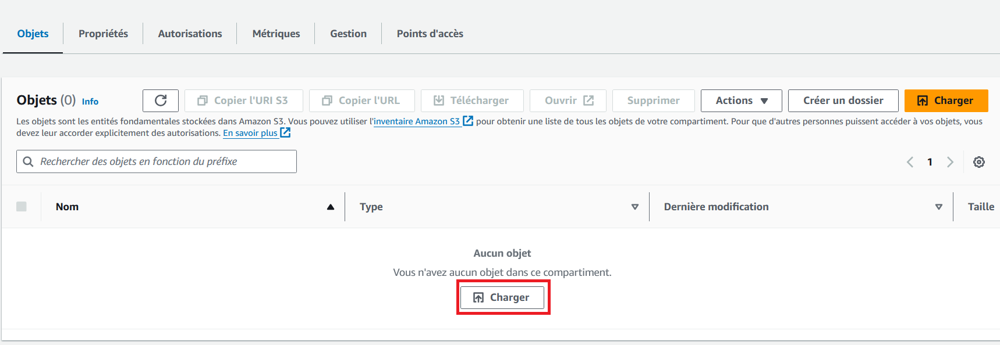

# https_static_website
Hosting an HTTPS static website using S3 and Amazon CloudFront

* Prepare your static files


### S3 setup

* Create the S3 bucket for hosting your website

* Choose a globally unique name for your S3 bucket

* By default, all public accesses to your S3 bucket are denied. In a static website hosting scenario, you need to enable this access

* All other parameters can be left as default. Create the bucket
* In the bucket list, click on your newly created bucket:
	- Upload your website files in the bucket

	- Modify the properties of the bucket 
	
		- Enable static web hosting
		- Set the hosting type to static website
		- Set the default page of your website
		
* Copy the website url, it will be needed for the creation of the Cloudfront distribution. Once the CloudFront distribution is created, we will come back to the S3 bucket to edit its bucket policy


### CloudFront setup

* Create a CloudFront distribution

* Paste the website url in the origin domain field
* Ensure you use HTTPS only

* You can optionally enable the web application firewall

* You can leave the other parameters as default and create the distribution
* Copy the arn of your newly created CloudFront distribution, you will need it for the bucket policy. 
* Copy also the url of your CloudFront distribution to later test the connection

### Edit the S3 bucket policy
* Go back to the Authorization tab of your S3 bucket to edit the bucket policy: the goal is to enable access only to your Cloudfront distribution

* Edit the resource to the arn of your S3 bucket, and the AWS:SourceArn to be the arn of your Cloud distribution

```
{
    "Version": "2012-10-17",
    "Statement": [
        {
            "Effect": "Allow",
            "Principal": {
                "Service": "cloudfront.amazonaws.com"
            },
            "Action": "s3:GetObject",
            "Resource": **""**,
            "Condition": {
                "StringEquals": {
                    "AWS:SourceArn": **""**
                }
            }
        }
    ]
}
```

* Save your changes and test the CloudFront url, you should now see the default page of your website. If you try to access directly the S3 website endpoint  without going through the CloudFront distribution, you should receive a Denied page.


